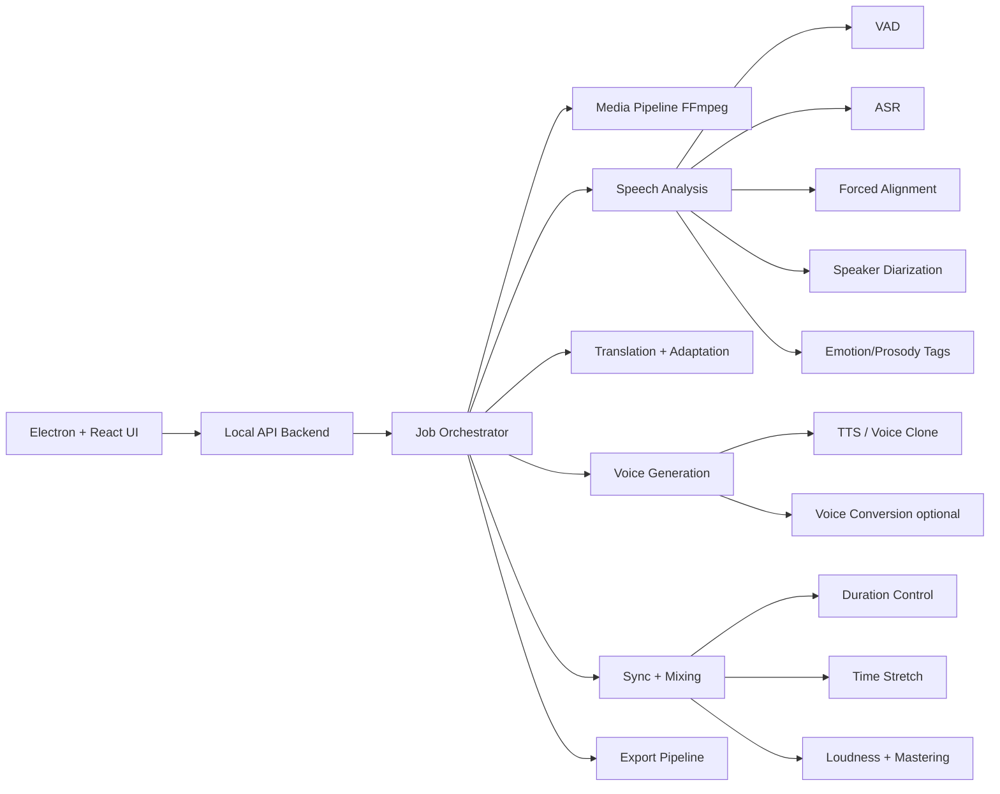

# Architecture - Anime/Manga/Manhua Dubbing Studio

Date de creation: 2026-05-16

## Vision

Construire une application desktop locale, open source first, capable de prendre une video source
(recap manga/webtoon/anime, narration, dialogues multi-personnages), d'en extraire les voix, de
transcrire, traduire, reconstruire des voix dans une autre langue, resynchroniser l'audio avec la
video, puis exporter une nouvelle video dubbee.

Objectif qualite: viser une synchronisation frame-level et une experience "studio". Le "parfait au
millimetre" doit etre traite comme une cible produit, pas comme une promesse automatique: on aura
besoin d'un pipeline IA + des outils de correction manuelle pour atteindre un resultat vraiment bon.

## Contraintes principales

- Hardware cible initial: laptop avec RTX 4050, CPU laptop Intel/Ryzen, RAM probablement limitee.
- Execution locale autant que possible.
- Outils open source uniquement pour le coeur IA.
- Interface desktop: Electron + React.
- Backend IA: Python, isole du frontend.
- Architecture modulaire pour pouvoir remplacer un modele sans casser toute l'application.
- Mode "qualite" et mode "rapide" selon la puissance disponible.

## Architecture generale



## Modules applicatifs

### 1. Desktop shell

Stack proposee:

- Electron pour l'application Windows desktop.
- React + Vite + TypeScript pour l'UI.
- Zustand ou Redux Toolkit pour l'etat global leger.
- TanStack Query pour suivre les jobs backend.
- Tailwind ou CSS modules selon le style final retenu.

Ecrans prevus:

- Dashboard projets recents.
- Import video.
- Analyse automatique.
- Timeline de dubbing.
- Editeur de transcription/traduction.
- Editeur speakers/personnages.
- Bibliotheque de voix.
- Preview video synchronisee.
- Export.
- Settings modeles/performance.

### 2. Backend local

Stack proposee:

- Python 3.11/3.12.
- FastAPI pour l'API locale.
- WebSocket/SSE pour progression temps reel.
- SQLite pour l'etat local des projets.
- Pydantic pour les schemas.
- Job queue locale simple au debut, puis Celery/RQ si necessaire.
- FFmpeg pour extraction audio, mux/demux, export.

Raison: Electron gere l'interface, Python gere les modeles IA. Les deux processus restent separes
pour eviter de melanger Node, CUDA, PyTorch et les dependances audio.

## Pipeline IA cible

### Phase A - Ingestion media

1. Importer la video.
2. Extraire audio WAV 16 kHz/24 kHz mono ou stereo selon besoin.
3. Detecter duree, FPS, resolution, pistes audio.
4. Creer un dossier projet avec manifests JSON.
5. Generer waveform + miniatures video.

Sorties:

- `source.mp4`
- `audio/source.wav`
- `analysis/media_manifest.json`
- `ui/waveform.json`
- `ui/thumbnails/`

### Phase B - Separation et nettoyage audio

Briques candidates:

- FFmpeg pour extraction/conversion.
- Demucs pour separer voix/musique/bruit si necessaire.
- Silero VAD ou pyannote VAD pour detecter les zones de voix.

Sorties:

- piste voix isolee.
- piste ambience/music conservee.
- segments voix bruts.

### Phase C - Transcription + timestamps

Briques candidates:

- WhisperX pour ASR, timestamps par mot, forced alignment et diarisation integree.
- faster-whisper/CTranslate2 pour inference plus efficace.
- pyannote.audio pour diarisation "qui parle quand".

Sorties:

- transcription source.
- timestamps mot par mot.
- segments phrases.
- speaker labels: `SPEAKER_00`, `SPEAKER_01`, etc.

### Phase D - Personnages et speakers

Objectif: transformer les speakers anonymes en personnages utilisables.

Fonctions:

- Regrouper les segments par speaker.
- Afficher chaque speaker avec extraits audio.
- Permettre a l'utilisateur de renommer: Narrateur, Hero, Rival, etc.
- Assigner une voix cible par personnage.
- Sauvegarder une "speaker memory" pour reutiliser une voix dans plusieurs episodes.

Important: la detection automatique ne sera jamais parfaite dans les animes/recaps avec musique,
effets et voix superposees. L'UI doit permettre de corriger vite.

### Phase E - Traduction et adaptation dubbing

Pipeline:

1. Traduire le texte source.
2. Adapter pour la duree orale cible.
3. Conserver le sens, l'energie, les noms propres.
4. Generer plusieurs variantes si le texte est trop long.
5. Mesurer la duree TTS estimee avant generation finale.

Briques candidates:

- NLLB/Marian/OPUS-MT pour traduction locale classique.
- Petit LLM local quantifie pour adaptation naturelle et contraintes de duree.
- Glossaire projet: noms, attaques, lieux, termes manga/manhwa.

Sorties:

- texte traduit.
- texte adapte au dubbing.
- contraintes de duree par segment.
- notes emotion/prosodie.

### Phase F - Emotion et prosodie

Objectif:

- detecter quand une voix crie, chuchote, pleure, rit, parle vite, est fatiguee, etc.
- transmettre ces tags au TTS si le modele le supporte.

Approche MVP:

- Heuristiques audio: volume, pitch, energie, vitesse.
- Tags manuels dans l'UI.

Approche avancee:

- classifieur emotion speech.
- VLM sur frames video pour detecter expression/action.
- modele de prosodie qui extrait rythme, pauses et intensite du segment original.

Sorties:

- `emotion`: neutral, angry, excited, sad, whisper, shout...
- `pace`: slow, normal, fast.
- `intensity`: 0-1.
- `pause_map`.

### Phase G - Generation vocale

Briques candidates a tester:

- F5-TTS: bon candidat pour voice cloning zero-shot/few-shot et multi-speaker.
- CosyVoice: interessant pour multilingue, instructions emotion/vitesse/volume selon modele.
- Fish Speech: candidat avance pour TTS multilingue expressif.
- Piper: fallback tres leger, moins naturel, utile pour mode CPU/simple.
- Supertonic 3: candidat TTS multilingue CPU-friendly, preset voices locales, custom voices via JSON Voice Builder externe.

Strategie:

- Interface d'adaptateurs: `TtsEngine`.
- Chaque engine expose les memes methodes: `prepare_voice`, `synthesize_segment`,
  `estimate_duration`, `supports_emotion`, `supports_voice_clone`.
- Ne jamais bloquer l'app sur un seul modele.

### Phase H - Synchronisation

Objectif:

- respecter debut/fin des segments originaux.
- garder les pauses.
- eviter que la voix deborde sur le segment suivant.

Techniques:

- adaptation texte avant TTS.
- controle vitesse TTS quand disponible.
- time-stretch leger avec Rubber Band/WSOLA/FFmpeg atempo.
- regeneration automatique si le segment depasse trop.
- crossfade et normalisation loudness.

Regles:

- Si ecart <= 5%: correction time-stretch legere.
- Si ecart 5-15%: adaptation texte + regeneration.
- Si ecart > 15%: proposer variantes a l'utilisateur.

### Phase I - Mixage et export

Pipeline:

1. Placer chaque segment TTS sur une timeline.
2. Ajuster gain par speaker/personnage.
3. Reintegrer musique/ambience si separee.
4. Ducking automatique sous voix.
5. Normaliser loudness.
6. Export WAV preview.
7. Mux avec video source via FFmpeg.

Exports:

- MP4 dubbe.
- WAV piste voix seule.
- WAV mix final.
- SRT/ASS source et traduit.
- JSON projet complet.

## Profils performance

### Profil laptop RTX 4050

- Traitement par chunks.
- Un seul gros modele charge a la fois.
- Precision fp16 si stable.
- Quantization quand disponible.
- Cache agressif des resultats intermediaires.
- Queue sequentielle: ASR -> diarisation -> traduction -> TTS -> mix.
- Preview basse resolution pour l'UI.

### Profil CPU/fallback

- ASR plus petit.
- TTS leger type Piper ou modele quantifie.
- Moins d'analyse emotion automatique.
- Export plus lent mais fonctionnel.

### Profil workstation/cloud futur

- Traitement parallele par segment.
- Plusieurs modeles residents.
- Batch TTS.
- VLM pour analyse scene/personnage.
- Fine-tuning voix/personnages.

## Structure de projet proposee

```text
anime_manga_manhua_dubbing_app/
  architecture.md
  apps/
    desktop/              # Electron + React + Vite
  services/
    api/                  # FastAPI backend
    worker/               # orchestration IA
  packages/
    shared/               # schemas partages TypeScript/Python si besoin
  models/
    registry.json         # modeles installes/local paths
  projects/
    .gitkeep              # projets utilisateur ignores par git
  docs/
    decisions/            # ADR techniques
  scripts/
    setup/
    dev/
```

## Modele de donnees initial

```text
Project
  id
  name
  source_video_path
  target_language
  created_at
  status

MediaAsset
  id
  project_id
  kind: source_video | source_audio | vocals | music | export
  path
  duration
  metadata

Speaker
  id
  project_id
  label
  display_name
  voice_profile_id
  color
  sample_segments

Segment
  id
  project_id
  speaker_id
  start_ms
  end_ms
  source_text
  translated_text
  adapted_text
  emotion
  intensity
  generated_audio_path
  sync_status

VoiceProfile
  id
  name
  engine
  reference_audio_path
  language
  settings

Job
  id
  project_id
  type
  status
  progress
  logs
  artifacts
```

## UI/UX cible

Principes:

- L'app doit ressembler a un studio de montage/dubbing, pas a une simple page IA.
- L'utilisateur doit toujours voir: video, waveform, segments, speakers, statut IA.
- Chaque resultat IA doit etre editable.
- Les erreurs doivent etre corrigeables sans relancer tout le projet.

Layout principal:

- Colonne gauche: projets, scenes, speakers.
- Centre: lecteur video + timeline.
- Bas: waveform/segments.
- Droite: inspecteur du segment selectionne.
- Barre haute: import, analyse, generer, exporter, settings.

Workflows MVP:

1. Importer video.
2. Lancer analyse.
3. Corriger speakers/textes.
4. Choisir langue cible.
5. Generer voix.
6. Previsualiser.
7. Exporter.

## Roadmap d'implementation

### Milestone 0 - Fondation

- Initialiser monorepo.
- Ajouter Electron + React + Vite + TypeScript.
- Ajouter FastAPI.
- Lancer desktop + backend local ensemble.
- Ajouter page d'accueil et import video mocke.
- Ajouter `architecture.md` comme journal vivant.

### Milestone 1 - Media pipeline

- Import video reel.
- Extraction audio via FFmpeg.
- Metadata video/audio.
- Waveform JSON.
- Preview video dans UI.
- Dossier projet local.

### Milestone 2 - ASR + segments

- Integrer WhisperX ou faster-whisper.
- Generer transcription timestamped.
- Afficher segments sur timeline.
- Export SRT.

### Milestone 3 - Diarisation speakers

- Integrer pyannote.audio.
- Assigner speaker par segment.
- UI de correction speaker.
- Couleurs/personnages.

### Milestone 4 - Traduction/adaptation

- Integrer moteur traduction local.
- Ajouter glossaire projet.
- Ajouter adaptation par contrainte de duree.
- UI edition source/traduction/adaptation.

### Milestone 5 - TTS mono-speaker

- Integrer un premier moteur TTS.
- Generer voix off simple.
- Coller l'audio genere sur timeline.
- Ajuster duree et export audio.

### Milestone 6 - Multi-speaker

- Voice profiles par personnage.
- Generation segment par segment.
- Cache audio par segment.
- Regeneration selective.

### Milestone 7 - Emotion/prosodie

- Detection emotion heuristique.
- Tags emotion manuels.
- Transmission au TTS si supporte.
- Intensite/vitesse par segment.

### Milestone 8 - Mixage/export final

- Ducking musique/ambience.
- Loudness normalization.
- Export MP4 final.
- Export assets projet.

### Milestone 9 - Qualite studio

- Comparaison timing original/dub.
- Score de sync par segment.
- Suggestions automatiques: raccourcir texte, ralentir, regenerer.
- Presets qualite/performance.
- Gestion batch episodes.

## Risques techniques

- Diarisation imparfaite sur audio anime/recap avec musique et effets.
- Voice cloning multilingue naturel peut varier selon langue/source.
- Emotion control open source encore inegal.
- RTX 4050 laptop: VRAM limitee, necessite chunking et model unloading.
- Traduction litterale trop longue pour tenir dans le timing original.
- Licences des modeles: chaque moteur doit etre verifie avant distribution commerciale.

## Decisions initiales

- UI: Electron + React + Vite + TypeScript.
- Backend: FastAPI + Python.
- Media: FFmpeg obligatoire.
- ASR/alignment candidat: WhisperX.
- Diarisation candidat: pyannote.audio.
- TTS candidats: F5-TTS, CosyVoice, Fish Speech, Piper fallback.
- Design produit: app de studio/timeline, pas landing page.
- Architecture: adaptateurs de modeles pour pouvoir changer de moteur.

## Journal des ajouts

Utiliser cette section pendant le developpement. Chaque changement important doit noter:

- Date.
- Fichiers ajoutes/modifies.
- Fonctionnalite.
- Decisions ou compromis.
- Commandes de verification.

### 2026-05-16

- Ajout de ce document initial `architecture.md`.
- Definition de la vision produit, architecture generale, pipeline IA, roadmap et risques.
- Ajout de `docs/interface-maquettes.md`.
- Decision de demarrage: commencer par les maquettes de l'interface avant la structure technique.
- Premier ecran prioritaire pour la maquette: Studio principal avec video, timeline, speakers et inspecteur.
- Ajout de `docs/assets/studio-main-mockup-v1.png` comme reference visuelle acceptee.
- Ajout de `docs/implementation-log.md` pour suivre les modifications au fil du developpement.
- Initialisation de la structure `apps/desktop`, `services/api`, `models` et `projects`.
- Premiere implementation React mockee de l'ecran Studio principal.
- Verification: build frontend OK, compilation Python OK, preview locale disponible sur `http://127.0.0.1:4173`.
- Evolution du shell Studio: interactions React ajoutees pour speakers, segments, inspecteur,
  edition texte, emotion, sliders, lock et progression de generation.
- Verification: `npm run build` OK apres ajout des interactions frontend.
- Ajout du premier pipeline media reel:
  - endpoint FastAPI `POST /media/probe`;
  - lecture des metadonnees via FFprobe;
  - affichage frontend des infos video/audio apres import.
- Verification: FFmpeg/FFprobe disponibles, `/health` OK, `/media/probe` OK sur video QA.
- Ajout de la preparation media:
  - endpoint FastAPI `POST /media/prepare`;
  - creation d'un dossier projet timestamped dans `projects/`;
  - extraction audio WAV mono 16 kHz via FFmpeg;
  - generation de peaks waveform pour la timeline;
  - ecriture de `analysis/media_manifest.json`;
  - branchement du bouton Analyze cote frontend.
- Verification: `/media/prepare` OK sur video QA, audio + manifest + waveform generes.
- Ajout du stream video local:
  - endpoint FastAPI `GET /media/stream?path=...`;
  - validation des extensions video supportees;
  - lecteur video reel dans la preview centrale apres import.
- Verification: `/media/stream` OK sur video QA, build frontend OK, compilation backend OK.
- Passe UI Studio:
  - menu Electron masque;
  - preview restructuree en video + colonne metadata/subtitle;
  - overlays retires de la video;
  - timeline et sidebar ajustes pour mieux tenir dans une fenetre laptop.
- Verification: build frontend OK, compilation backend OK.
- Ajout des vues applicatives principales dans le shell React:
  - `Studio`;
  - `Transcript`;
  - `Speakers`;
  - `Export`.
- Objectif: eviter que tous les outils soient empiles dans le meme ecran et garder un workflow plus proche d'un logiciel de studio.
- Verification: build frontend OK, compilation backend OK.
- Correction de la hierarchie applicative:
  - navigation principale: `Dashboard`, `Projects`, `Studio`, `Settings`;
  - sous-navigation Studio: `Timeline`, `Transcript`, `Speakers`, `Export`;
  - ajout des vues initiales Dashboard, Projects et Settings.
- Verification: build frontend OK, compilation backend OK.
- Topbar compactee:
  - barre globale limitee au projet et statut machine;
  - commandes Import/Analyze/Generate/Preview/Export deplacees dans le Studio;
  - objectif: recuperer de l'espace vertical pour la preview et la timeline.
- Verification: build frontend OK, compilation backend OK.
- Refonte UI professionnelle:
  - adoption de Tailwind et d'une base `components.json` compatible shadcn;
  - composants UI source-style dans `apps/desktop/src/components/ui`;
  - themes persistants: System, Light Studio, Dark Studio, Graphite Pro;
  - onboarding premier lancement;
  - systeme projets local via localStorage;
  - shell principal Dashboard/Projects/Studio/Settings;
  - Studio conserve Timeline/Transcript/Speakers/Export comme sous-outils;
  - Electron stabilise avec GPU desactive et userData local.
- Verification: build frontend OK, compilation backend OK, frontend disponible sur `http://127.0.0.1:5173`.

### 2026-05-17

- Couche design system:
  - `apps/desktop/tailwind.config.js` contient les tokens relies aux variables CSS;
  - `apps/desktop/src/styles.css` porte les themes et les surfaces desktop;
  - `apps/desktop/components.json` garde la convention shadcn/source-first;
  - `apps/desktop/src/lib/utils.ts` fournit `cn()` pour composer les classes;
  - les primitives UI locales vivent dans `apps/desktop/src/components/ui`.
- Couche application:
  - `apps/desktop/src/App.tsx` est maintenant le shell applicatif avec etat de routing local;
  - onboarding, theme, projets et projet actif sont persistants via localStorage;
  - les vues principales sont `Dashboard`, `Projects`, `Studio`, `Settings`;
  - les sous-vues Studio sont `Timeline`, `Transcript`, `Speakers`, `Export`.
- Compromis actuel:
  - le systeme projet reste local cote frontend pour aller vite et valider l'UX;
  - le backend FastAPI reste concentre sur probe/prepare/stream;
  - les composants Dialog/Sheet/Tooltip pourront etre ajoutes ensuite quand les workflows en auront besoin.
- Verification:
  - `npm run build` OK;
  - `python -m py_compile services\\api\\app\\main.py` OK;
  - dev app OK sur `http://127.0.0.1:5173`.

- Backend foundation avant multilingue:
  - FastAPI expose maintenant un statut runtime (`/runtime/status`) pour verifier outils locaux et etapes pipeline;
  - les projets sont lus depuis `projects/*/project.json` ou reconstruits depuis `analysis/media_manifest.json`;
  - la preparation media ecrit un `project.json` avec statut, chemins source/manifest et langues si disponibles;
  - Electron demarre le serveur FastAPI en sidecar si aucun backend ne repond deja sur `127.0.0.1:8766`;
  - le frontend surveille `/health` et synchronise les projets backend dans la liste locale.
- Decision: avant d'ajouter traduction/ASR/TTS, stabiliser la couche projet/job pour que chaque etape IA ait un etat recuperable apres redemarrage.

- Analyse machine et registry IA:
  - machine actuelle detectee: Dell Latitude E7270, Intel Core i5-6300U, 8 GB RAM, Intel HD Graphics 520, pas de CUDA;
  - cette machine devient le profil `current_cpu_fallback`;
  - la RTX 4050 laptop reste le profil cible `rtx4050_balanced`;
  - `models/registry.json` liste les moteurs candidats, leur profil supporte, leurs limites et leurs sources;
  - `/models/registry` expose cette selection au frontend;
  - `/runtime/status` expose aussi un bloc `hardware` pour diagnostiquer le poste local.
- Decision: commencer l'IA reelle par ASR CPU fallback (`whisper.cpp` tiny/base) et garder faster-whisper/pyannote/F5-TTS/CosyVoice pour la machine RTX 4050 ou les etapes de benchmark.

- Onboarding adaptatif:
  - au lancement, le frontend interroge `/health`, `/runtime/status` et `/models/registry`;
  - l'onboarding affiche CPU, RAM et acceleration disponible;
  - le profil machine est choisi automatiquement:
    - CUDA detecte: profil GPU/quality ou balanced selon VRAM;
    - RAM/threads suffisants sans CUDA: profil balanced laptop;
    - petite machine: profil CPU fallback;
  - cette decision sera ensuite reutilisee pour choisir les jobs IA autorises et les modeles telechargeables.

- Etat d'analyse projet:
  - `analysis/state.json` devient la source persistante pour les speakers et segments visibles dans le Studio;
  - `GET /projects/{project_id}/analysis/state` charge cet etat;
  - `PUT /projects/{project_id}/analysis/state` sauvegarde les corrections UI;
  - `POST /media/prepare` cree un premier brouillon de segments selon la duree media;
  - l'ASR/diarisation remplacera progressivement ce brouillon par des donnees reelles.
- Decision: les donnees du Studio doivent venir du projet actif autant que possible; les donnees hardcodees React ne servent plus qu'au fallback d'etat vide.

- Jobs projet:
  - les actions longues passent par `projects/<id>/jobs/*.json`;
  - `GET /projects/{project_id}/jobs` liste les jobs;
  - `POST /projects/{project_id}/jobs` cree un job;
  - `GET /projects/{project_id}/jobs/{job_id}` recupere un job;
  - les jobs actuels sont des placeholders persistants pour connecter l'UI avant les moteurs IA reels;
  - le port API actif est `8766` pour eviter une ancienne instance Windows coincee sur `8765`.

- Lancement desktop fiable:
  - lancement utilisateur Windows: double-clic sur `scripts/start-desktop-silent.vbs`;
  - commande debug/dev: `npm run start:desktop`;
  - `scripts/start-desktop-silent.vbs` lance directement `electron.exe` avec `apps/desktop` comme application, sans `cmd.exe` ni `npm.cmd`;
  - `scripts/start-desktop.cjs` reste disponible comme launcher debug, mais Electron reste responsable du sidecar FastAPI;
  - Electron est lance depuis `apps/desktop` avec l'argument `.` afin d'eviter les bugs de chemins contenant des espaces;
  - `mainWindow` reste une reference globale dans `electron/main.cjs`;
  - un verrou d'instance unique empeche les doubles fenetres et renvoie les lancements suivants vers la fenetre existante;
  - Vite utilise `base: "./"` pour que les assets du build se chargent correctement depuis `file://` dans Electron;
  - les logs de lancement sont dans `projects/desktop-launcher.log` et `projects/electron-main.log`;
  - CORS accepte l'origine `null` pour le renderer Electron charge depuis `file://`.

- Couche TTS backend:
  - `services/api/app/tts_service.py` isole les moteurs TTS et charge les dependances lourdes seulement au moment de generer;
  - `supertonic` est branche comme moteur optionnel via `engine="supertonic"` et peut etre force pour test avec `DUB_TTS_ENGINE=supertonic`;
  - les assets Supertonic sont stockes dans `models/supertonic` pour eviter le cache utilisateur Windows;
  - l'integration Supertonic reste opt-in car le premier usage peut telecharger les assets publics depuis Hugging Face;
  - `voice_generation` produit maintenant un manifest d'audio avec moteur, langue, profil machine, segments generes et echecs;
  - l'etat d'analyse conserve `source_language` et `target_language` pour que les jobs backend ne dependent pas uniquement du frontend;
  - les textes placeholder comme `Pending transcription.` sont ignores par le TTS.

- Jobs persistants:
  - la creation d'un job ecrit d'abord un `JobRecord` en statut `queued`;
  - l'execution se fait en tache de fond FastAPI et met a jour le meme fichier JSON en `running`, puis en statut terminal;
  - le frontend relit periodiquement les jobs du projet et recharge l'analyse quand un job ASR/traduction se termine;
  - cette couche reste volontairement locale et simple avant d'introduire une vraie queue worker separee.

- ASR Faster Whisper:
  - le premier moteur ASR reel cible `faster-whisper` avec `Systran/faster-whisper-tiny` comme modele par defaut;
  - les modeles ASR sont globaux a l'application et vivent sous `models/asr/faster-whisper/<model_id>`;
  - Settings liste Tiny/Base/Small/Medium et lance le telechargement en arriere-plan;
  - un job ASR sans modele installe se termine en `skipped` avec une instruction de telechargement;
  - quand Tiny est installe, le job ASR transcrit `audio/source_16k_mono.wav` et remplace les segments draft par des segments ASR.
