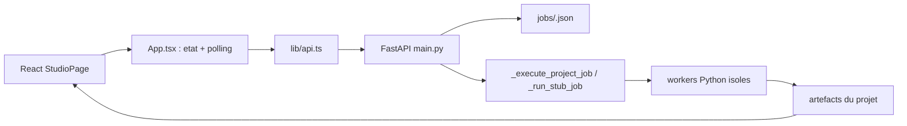

# DubRoom Multi-Speaker V2 - carte d'implementation

> Source fonctionnelle : `DubRoom_Roadmap_MultiSpeaker_V2.docx` (8 aout 2026).  
> But de cette carte : eviter de rescanner le depot a chaque session. La prochaine implementation doit commencer par la section **M0** et les fichiers listes dans **Perimetre de lecture minimal**.

## 1. Etat reel du depot

Le depot est une application locale Electron/React pilotee par une API FastAPI. Les documents historiques parlent parfois d'un dossier `services/worker`, d'une base SQLite et d'une file de jobs dediee ; ce n'est pas l'implementation actuelle.



- Electron ne contient pas le pipeline IA. Il fournit la configuration runtime et les dialogues fichiers.
- `App.tsx` possede le projet actif, l'analyse, les jobs et le polling (environ toutes les 3,5 s).
- `main.py` contient les routes, les modeles Pydantic, la persistence projet et le dispatcher des jobs.
- Les jobs sont des fichiers JSON persistants dans chaque projet. Les jobs `queued`/`running` deviennent `interrupted` au redemarrage.
- `activity_service.py` detecte automatiquement tout fichier `projects/<id>/jobs/*.json`. Un nouveau job M0 apparaitra donc dans l'activite globale sans nouveau stockage.
- Les moteurs lourds vivent dans `data/environments/<runtime-id>/venv` et sont lances comme sous-processus.
- Le registre contient deja `demucs-separation` et `pyannote-community`, mais aucun worker/adapter executable n'est encore branche pour ces categories.

## 2. Flux projet actuel

1. `POST /media/prepare` sonde la video et cree le projet.
2. La preparation extrait `audio/source_16k_mono.wav` (mono, 16 kHz), construit la waveform, puis ecrit `analysis/media_manifest.json`, `analysis/state.json` et `project.json`.
3. Le frontend lance `POST /projects/{id}/jobs` avec un type generique.
4. FastAPI ecrit le job, le passe a `BackgroundTasks`, puis `_execute_project_job` met a jour progression/statut.
5. `_run_stub_job` distribue vers ASR, traduction, voix, preview ou export.
6. L'UI relit les jobs et recharge `analysis/state.json` apres les jobs qui le modifient.

Point important : malgre son nom, `_run_stub_job` contient le vrai pipeline. Ne pas creer un second orchestrateur pour M0.

## 3. Convention de stockage actuelle

```text
projects/<project-id>/
  project.json
  analysis/
    media_manifest.json
    state.json
    history/state-rXXXXXXXX.json
    timeline-v2.json
    asr_manifest.json
    <worker>.input.json / .output.json / .progress.json / .log
  audio/
    source_16k_mono.wav
    <segment-id>.wav
    voiceover.wav
    voice_manifest.json
  jobs/
    <job-type>-<token>.json
  exports/
    export_manifest.json
    ...
```

Les racines sont centralisees dans `services/api/app/config.py` et surchargeables par `DUBSTUDIO_*_ROOT`. Ne jamais coder en dur le chemin du depot ou de `projects/`.

## 4. Overlay V2 a ajouter sans casser l'existant

```text
projects/<project-id>/
  audio/
    source/
      original.wav
    separation/
      vocals.wav
      bed.wav
      separation-manifest.json
      worker.input.json
      worker.output.json
      worker.progress.json
      worker.log
      worker.err.log
```

Decision de chemin : la V2 mentionne a la fois `audio/separation/separation-manifest.json` et `audio/separation-manifest.json`. La forme canonique retenue est la premiere, car elle garde tous les artefacts de separation ensemble. Le lecteur pourra tolerer l'autre chemin si un prototype ancien l'a deja produit.

Regles de compatibilite :

- conserver `audio/source_16k_mono.wav` pour l'ASR existant ;
- ne pas remplacer `source_path` par un stem ; il reste la video source active ;
- ne pas mettre M0 dans `analysis/state.json` : son manifeste separe evite les conflits de revision du script ;
- un projet sans manifeste de separation continue exactement comme avant ;
- aucun ancien artefact n'est supprime ou deplace automatiquement.

## 5. M0 Audio Preservation - points d'insertion

### Backend

Nouveau `services/api/app/audio_preservation_service.py` :

- resoudre les chemins du projet ;
- calculer le fingerprint (source + taille/mtime ou hash + moteur + modele + parametres) ;
- reutiliser un manifeste `ready` identique ;
- extraire `original.wav` en PCM haute fidelite ;
- lancer le worker isole ;
- valider duree, existence et lisibilite de `vocals.wav` et `bed.wav` ;
- ecrire le manifeste atomiquement ;
- remonter progression, annulation et erreurs sans faire tomber FastAPI.

Nouveau `scripts/engines/run-audio-separation.py` :

- executable par le Python de `data/environments/demucs-separation/venv` ;
- entrees/sorties JSON explicites ;
- progression JSON comme les workers ASR/traduction ;
- aucune importation du runtime Demucs dans FastAPI ;
- sortie deux stems normalises : `vocals.wav` et `bed.wav`.

Branchements dans `services/api/app/main.py` :

- accepter le job `audio_separation` ;
- ajouter son libelle dans `_job_label` ;
- le distribuer depuis `_run_stub_job` vers le service M0 ;
- reutiliser `JobRecord`, `_write_job`, l'annulation et la reconciliation existants ;
- ajouter des routes minces :
  - `POST /projects/{id}/audio/separate` ;
  - `GET /projects/{id}/audio/separation` ;
  - `GET /projects/{id}/audio/preservation/{track}` pour `original`, `vocals`, `bed`.

Le `POST` peut deleguer au meme createur de job que `/projects/{id}/jobs`; il ne doit pas dupliquer l'orchestration.

Branchement moteur dans `services/api/app/engine_service.py` :

- reconnaitre la categorie `separation` ;
- verifier la presence de `scripts/engines/run-audio-separation.py` ;
- utiliser l'environnement existant `demucs-separation` ;
- ne toucher a aucun environnement ASR/TTS/RVC stable.

### Frontend

- `types.ts` : ajouter un DTO de manifeste/statut M0 ; ne pas gonfler `AnalysisState`.
- `lib/api.ts` : status, lancement et URLs des trois pistes.
- `App.tsx` : exposer `onSeparateAudio`; le polling jobs existant suffit. Ne recharger `analysis/state.json` que si un job modifie vraiment l'analyse.
- `StudioPage.tsx` : placer la carte Audio Preservation dans le domaine Media/`cleanup`, avec statut, progression, trois previews, relance et erreur.
- `i18n.tsx` : ajouter les libelles FR/EN au meme endroit que les autres textes Studio.

L'etape `cleanup` existe deja dans `StudioStep` et retombe actuellement sur le mode Media. Il n'est pas necessaire d'ajouter une nouvelle grande page pour M0.

## 6. Ce qui existe deja et doit etre reutilise

| Besoin V2 | Implementation existante |
| --- | --- |
| Jobs persistants | `JobRecord` + `projects/<id>/jobs/*.json` |
| Progression UI | polling de `App.tsx` + cartes de jobs dans `StudioPage.tsx` |
| Annulation/reprise | route cancel, activites globales, reconciliation `interrupted` |
| Environnements isoles | `PATHS.environments` + `engine_runtime_id` |
| Installation Demucs | entree `demucs-separation` + installateur Python generique |
| Installation Pyannote | entree `pyannote-community` + credentials HF |
| Source media | `ProjectRecord.source_path` + `media_manifest.json` |
| ASR compatible | `source_16k_mono.wav`, a conserver |
| Voix par segment | `audio/<segment-id>.wav` + `voice_manifest.json` |
| Mix/export | `sync_service.py` + `export_service.py` (a reutiliser en M7/M8, pas en M0) |

## 7. Ordre d'implementation recommande

1. Contrat M0, chemins et fingerprint dans `audio_preservation_service.py`.
2. Worker Demucs isole et validation sur une video de test.
3. Job `audio_separation`, routes status/audio et gestion d'erreur.
4. Tests cache + echec worker + ancien projet sans manifeste.
5. UI minimale Original / Voices / SFX + Music.
6. Validation auditive du `bed.wav`.
7. Seulement ensuite : worker Pyannote, alignement ASR, schemas V2, registry personnages.

## 8. Perimetre de lecture minimal pour la prochaine session

Lire uniquement :

1. ce fichier ;
2. `services/api/app/config.py` ;
3. `services/api/app/main.py` autour des modeles projet/job, des routes jobs, de `_execute_project_job`, `_run_stub_job`, `_list_jobs` et `_write_job` ;
4. `services/api/app/engine_service.py` autour de `engine_runtime_id`, `adapter_contract` et `run_install` ;
5. `models/registry.json` uniquement pour `demucs-separation` ;
6. `scripts/engines/run-asr.py` uniquement comme contrat de worker/progression ;
7. `apps/desktop/src/types.ts`, `lib/api.ts`, `App.tsx` autour du polling/jobs ;
8. `StudioPage.tsx` autour des props, modes et du domaine Media.

Ignorer pendant M0 : `backups/`, `projects/`, `exports/`, `node_modules/`, les fichiers `*.backup-*`, TTS/RVC, Character Registry, Shorts, OCR/VLM et le mix final.

## 9. Definition of Done de la cartographie

- Les quatre zones demandees par la roadmap sont localisees : jobs, workers, etat projet, chemins.
- Les composants a reutiliser sont separes des composants a creer.
- Le chemin M0 est fixe et retrocompatible.
- La prochaine session peut commencer directement par le service M0 sans inventaire global du depot.

## 10. Etat implemente : M0 + Voice Library

### Audio Preservation

- Demucs `htdemucs` utilise CUDA via le runtime partage `tts-omnivoice-hq`.
- Le runtime CPU de `demucs-separation` reste le repli de securite.
- Le scheduler reserve maintenant le slot correspondant au device reel (`cuda` ou `cpu`).
- Reglages : segment 7 s, overlap 0.25, shifts 1, sortie `vocals` + `bed`.
- Benchmark local RTX 4060 Laptop : 60 s en 7.78 s, 5 min en 17.63 s.

### Voice Library

- Service central : `services/api/app/voice_library_service.py`.
- Builder local : `scripts/engines/create-omnivoice-voice-library.py`.
- Configuration des 18 voix : `scripts/engines/omnivoice-voice-library.json`.
- Stockage genere : `data/voice-library/omnivoice/`.
- Profils synchronises : `data/voice-profiles/profiles.json`, IDs `omnivoice-M01` a `omnivoice-CRE01`.
- UI : `apps/desktop/src/components/voice/OmniVoiceLibraryPanel.tsx` dans la page Library.
- Routes :
  - `GET /tts/voice-library` ;
  - `POST /tts/voice-library/omnivoice/build` ;
  - `POST /tts/voice-library/omnivoice/cancel`.
- Tous les moteurs TTS sont classes par source vocale (`preset`, `cloned`, `designed`), expression et streaming.
- Les profils actuels sont `single-speaker` par generation et `multi_speaker_compatible` pour le casting.
- Le mode multi-speaker reste une orchestration : un speaker detecte recoit un profil vocal stable.

### Perimetre minimal pour la prochaine etape multi-speaker

Lire uniquement : ce fichier, `voice_library_service.py`, `local_voice_service.py`, les routes TTS de `main.py`, puis les blocs speaker/voice assignment de `StudioPage.tsx`. Ne rescanner ni les environnements TTS ni le builder OmniVoice sauf echec explicite.

## 11. Etat implemente : detection multi-speaker

- Entree obligatoire : `projects/<id>/audio/separation/vocals.wav` produite par Audio Preservation.
- Service : `services/api/app/diarization_service.py`.
- Worker isole : `scripts/engines/run-speaker-diarization.py`.
- Runtime commun : Pyannote 4 deja present dans `whisperx-alignment`; aucune reinstallation si ce runtime reste compatible.
- Modele : `pyannote/speaker-diarization-community-1`, installe une seule fois via `install-pyannote-community.ps1` apres acceptation des conditions et saisie du jeton Hugging Face.
- Les jobs projet sont strictement hors ligne (`HF_HUB_OFFLINE=1`) et ne telechargent jamais silencieusement.
- Audio de travail : copie mono PCM 16 bits a 16 kHz, afin d'eviter les differences TorchCodec entre environnements.
- Sortie canonique : `analysis/diarization/diarization-manifest.json` avec locuteurs, tours exclusifs, fingerprint et temps d'execution.
- Cache : source + modele + bornes min/max de locuteurs; une relance identique ne rappelle pas Pyannote.
- Reconciliation : chaque segment ASR recoit le locuteur ayant le chevauchement temporel maximal; en l'absence de chevauchement, le tour le plus proche est choisi.
- Casting : les noms stables `Speaker 1`, `Speaker 2`, etc. preservent les profils vocaux deja affectes.
- UI : panneau dans le domaine Cast avec prerequis, progression, nombre de locuteurs, nombre de tours, runtime partage et relance forcee.
- Routes :
  - `GET /projects/{id}/diarization` ;
  - `POST /projects/{id}/diarize` ;
  - job generique `diarization` pleinement execute par le pipeline existant.

Limite locale actuelle : le runtime est pret, mais les poids Community-1 ne sont pas encore presents. Le test fonctionnel utilise un worker simule et valide le job, le cache, le mapping temporel et la preservation du profil OmniVoice. Le premier essai reel attend uniquement le jeton Hugging Face de l'utilisateur.
